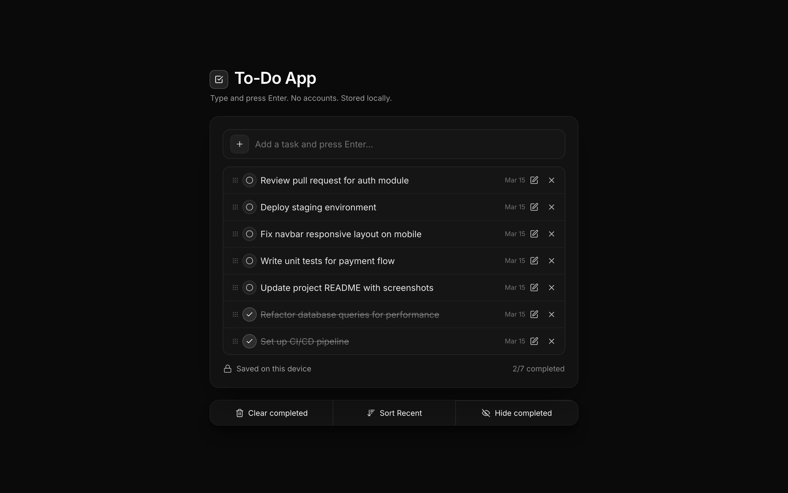

# Todo App

A clean, local-first todo app built with React, TypeScript, and Tailwind CSS. No accounts required — all data is stored locally in your browser.

## Screenshot



## Features

- Add, complete, and delete tasks
- Inline editing — click edit to rename any task
- Drag-and-drop reordering
- Sort by recent or oldest first
- Hide/show completed tasks
- Clear all completed tasks
- Local storage persistence
- Responsive design
- Dark theme

## Tech Stack

- **React 18** + TypeScript
- **Vite** — build tool
- **Tailwind CSS** — styling
- **Lucide React** — icons
- **@dnd-kit** — drag-and-drop reordering
- **Local Storage** — data persistence

## Run Locally

```bash
git clone https://github.com/1shanpanta/todoapp.git
cd todoapp
npm install
npm run dev
```

## Build

```bash
npm run build
```
